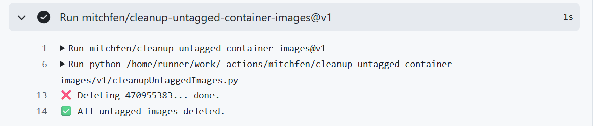

A GitHub action that can be used to delete untagged container images for a specified user. This action is currently only able to delete packages for a **user** not an organization.

### Example usage:
```yaml
- uses: mitchfen/cleanup-untagged-container-images@v1
  with:
    username: 'mitchfen'
    container-name: 'nanoleaf-controller'
    token: ${{ secrets.GHCR_TOKEN }}
```

### Example output:


