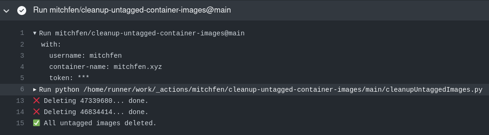

A GitHub action that can be used to delete untagged container images for a specified user.  
Please note: This action is currently only able to delete packages for a **user** not an organization.

### Example usage:
```yaml
# In this example GHCR_TOKEN has the packages:delete permission
- uses: mitchfen/cleanup-untagged-container-images@v1.0.2
  with:
    username: 'mitchfen'
    container-name: 'mitchfen.xyz'
    token: ${{ secrets.GHCR_TOKEN }}
```

### Example output:

